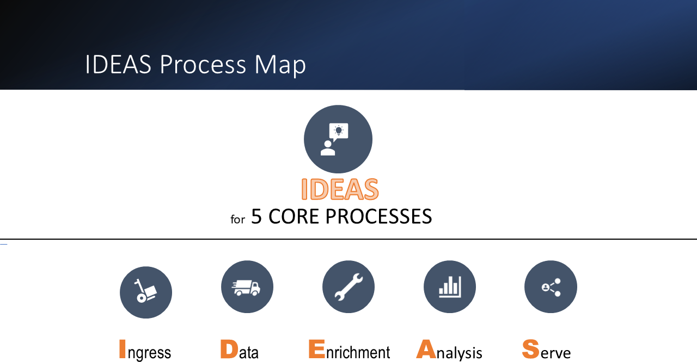

.. DAVT documentation master file, created by
   sphinx-quickstart on Thu Oct  6 19:07:54 2016.
   You can adapt this file completely to your liking, but it should at least
   contain the root `toctree` directive.

.............................................................................

GIFT/DAVT Documentation
===================================

.. list-table::
    :widths: 20 80
    :header-rows: 1

    * - **Project Information**
      - Description
    * - **Open Source Project Name**
      - GIFT/DAVT Gold Ideas First Templates
    * - **CDC Internal Project Name**
      - Data Analytics and Visualization Templates
    * - **GitHub Repository URL**
      - https://github.com/cdcent/davt

.............................................................................

   The largest impact to projects implementing the templates is
   based on process change rather than technical change. All implementations
   of DAVT should have a functioning report available in the first week and
   usually the first few days using data created for demonstration purposes.

   The key rule in implementing DAVT is to begin with the end in mind.

   For instance, during a typical implementation, data from current
   manually created customer reports are usually pasted into Excel, analyzed and
   used to create a data model and report mockup as a starting point for agile development.

.............................................................................

.............................................................................

    The GIFT/DAVT services support over 100 use cases organized around 10 personas/roles.
    The templates have been used on 10 projects across 4 centers at the CDC.
    Most use cases in the templates fall into 5 top level swim lane processes

    The Ingress, Data load, Enrichment, Analysis and Serve processes form
    the five core pillar IDEAS of the templates.

    Documentation is only available internally at CDC while pending review.

.............................................................................
