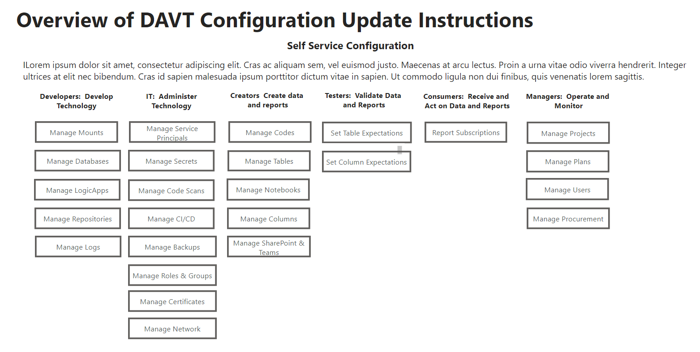

# Gold Idea First Templates (GIFT)

## Overview

This project delivers reusable Data, Analytics and Visualization Templates, known internally known as DAVT at the CDC, that are currently used on 5 projects across 3 centers.

The project uses the Databricks methodology of referencing system inputs as bronze data and system outputs as gold data. Data transformations between bronze and gold are referred to as silver data. The project is named gold idea first templates (GIFT) because a key principle of the architecture is to begin with the end in mind (gold data) and prioritize the ideas for generating end user output (gold data) first before delving into the technical details of expected bronze input.

The templates use an architecture designed to be self service, data driven, event-driven, loosely coupled, multi-vendor and multi-tenant. The process of creating new ETL processes or reports is self-service and does not require knowledge of procedural programming such as Python. Definitions of the architectural patterns for self-service, data driven, event-driven, loosely coupled, and multi-tenant are provided in the project description.


## GIFT Data, Analytics and Visualization Use Roles and Use Cases

The feature list may seem overwhelming.  The following chart highlights the use cases that are applicable to the different roles.  An individual where may multiple hats and perform different roles.  All items in green can be performed with no procedural programming and are designe for self-service BI in the delta lake storefront.  Items in the red part of the flow are designed to be performed in the delta lake developer kitchen by trained IT professionals.


The self service lists are maintained by updating data stored in lists that are maintained in SharePoint, Google Sheets or a similar tool that synchs the data with csv files stored in Azure Storage upon update.

A example of the menu for list maintenance is below.


## GIFT Data, Analytics and Visualization Platform Features - Self Assessment

GIFT provides functioning product artifacts with working sample implementations for the following best practices.  Currently vendors are not implementing these standard best practices in their soulution accelerators and examples.

You can assess if your organization has patterns and practices for the project processes and deliverables listed below.  If there are areas where your organization has gaps, the GIFT templates may help you fill in those gaps.  We have added a self assessment questionnaire and sample artifacts to help with your assessment to the GIFT project roadmap.  If you have standards for these processes and deliverables on an individual project, are the those processes and deliverables consistent on all projects across your organization?

| **Self-Assessment and Comparison** |  &nbsp;  **GIFT**  &nbsp; | **Your Project** | **Databricks** | **Microsoft** |
| --- | --- | --- | --- | --- |
| **Requirements and Governance Framework**   | &nbsp;  &nbsp;  **:heavy_check_mark:** | &nbsp;  &nbsp;   &nbsp; **:grey_question:**|&nbsp;  &nbsp;   &nbsp;  **:x:** |  &nbsp;  &nbsp;   &nbsp;**:x:** |
| Sample Project Plan Templates | &nbsp;  &nbsp;  **:heavy_check_mark:** | &nbsp;  &nbsp;   &nbsp; **:grey_question:**|&nbsp;  &nbsp;   &nbsp;  **:x:** |  &nbsp;  &nbsp;   &nbsp;**:x:** |
| Mission and Vision Template | &nbsp;  &nbsp;  **:heavy_check_mark:** | &nbsp;  &nbsp;   &nbsp; **:grey_question:**|&nbsp;  &nbsp;   &nbsp;  **:x:** |  &nbsp;  &nbsp;   &nbsp;**:x:** |
| Policies, Standard and Glossary Templates  | &nbsp;  &nbsp;  **:heavy_check_mark:** | &nbsp;  &nbsp;   &nbsp; **:grey_question:**|&nbsp;  &nbsp;   &nbsp;  **:x:** |  &nbsp;  &nbsp;   &nbsp;**:x:** |
| Requirements Templates  | &nbsp;  &nbsp;  **:heavy_check_mark:** | &nbsp;  &nbsp;   &nbsp; **:grey_question:**|&nbsp;  &nbsp;   &nbsp;  **:x:** |  &nbsp;  &nbsp;   &nbsp;**:x:** |
| **Software Procurement and Setup**  | &nbsp;  &nbsp;  **:heavy_check_mark:** | &nbsp;  &nbsp;   &nbsp; **:grey_question:**|&nbsp;  &nbsp;   &nbsp;  **:x:** |  &nbsp;  &nbsp;   &nbsp;**:x:** |
| Desktop Configuration Templates   | &nbsp;  &nbsp;  **:heavy_check_mark:** | &nbsp;  &nbsp;   &nbsp; **:grey_question:**|&nbsp;  &nbsp;   &nbsp;  **:x:** |  &nbsp;  &nbsp;   &nbsp;**:x:** |
| Cloud Configuration Templates   | &nbsp;  &nbsp;  **:heavy_check_mark:** | &nbsp;  &nbsp;   &nbsp; **:grey_question:**|&nbsp;  &nbsp;   &nbsp;  **:x:** |  &nbsp;  &nbsp;   &nbsp;**:x:** |
| **Security and Identity**  | &nbsp;  &nbsp;  **:heavy_check_mark:** | &nbsp;  &nbsp;   &nbsp; **:grey_question:**|&nbsp;  &nbsp;   &nbsp;  **:x:** |  &nbsp;  &nbsp;   &nbsp;**:x:** |
| Manage and Onboard Partners and Organizations   | &nbsp;  &nbsp;  **:heavy_check_mark:** | &nbsp;  &nbsp;   &nbsp; **:grey_question:**|&nbsp;  &nbsp;   &nbsp;  **:x:** |  &nbsp;  &nbsp;   &nbsp;**:x:** |
| Manage and Onboard Systems and Projects   | &nbsp;  &nbsp;  **:heavy_check_mark:** | &nbsp;  &nbsp;   &nbsp; **:grey_question:**|&nbsp;  &nbsp;   &nbsp;  **:x:** |  &nbsp;  &nbsp;   &nbsp;**:x:** |
| Manage and Onboard Users and Roles  | &nbsp;  &nbsp;  **:heavy_check_mark:** | &nbsp;  &nbsp;   &nbsp; **:grey_question:**|&nbsp;  &nbsp;   &nbsp;  **:x:** |  &nbsp;  &nbsp;   &nbsp;**:x:** |
| Automated Code Scans | &nbsp;  &nbsp;  **:heavy_check_mark:** | &nbsp;  &nbsp;   &nbsp; **:grey_question:**|&nbsp;  &nbsp;   &nbsp;  **:x:** |  &nbsp;  &nbsp;   &nbsp;**:x:** |
| **Populate Data**  | &nbsp;  &nbsp;  **:heavy_check_mark:** | &nbsp;  &nbsp;   &nbsp; **:grey_question:**|&nbsp;  &nbsp;   &nbsp;  **:x:** |  &nbsp;  &nbsp;   &nbsp;**:x:** |
| Reusable meta-data driven data transfer process  | &nbsp;  &nbsp;  **:heavy_check_mark:** | &nbsp;  &nbsp;   &nbsp; **:grey_question:**|&nbsp;  &nbsp;   &nbsp;  **:x:** |  &nbsp;  &nbsp;   &nbsp;**:x:** |
| Reusable meta-data driven bronze load process  | &nbsp;  &nbsp;  **:heavy_check_mark:** | &nbsp;  &nbsp;   &nbsp; **:grey_question:**|&nbsp;  &nbsp;   &nbsp;  **:x:** |  &nbsp;  &nbsp;   &nbsp;**:x:** |
| Reusable meta-data driven silver transform process   | &nbsp;  &nbsp;  **:heavy_check_mark:** | &nbsp;  &nbsp;   &nbsp; **:grey_question:**|&nbsp;  &nbsp;   &nbsp;  **:x:** |  &nbsp;  &nbsp;   &nbsp;**:x:** |
| Reusable meta-data driven gold aggregate process  | &nbsp;  &nbsp;  **:heavy_check_mark:** | &nbsp;  &nbsp;   &nbsp; **:grey_question:**|&nbsp;  &nbsp;   &nbsp;  **:x:** |  &nbsp;  &nbsp;   &nbsp;**:x:** |
| **Publish Data, Analytics and Visualizations**  | &nbsp;  &nbsp;  **:heavy_check_mark:** | &nbsp;  &nbsp;   &nbsp; **:grey_question:**|&nbsp;  &nbsp;   &nbsp;  **:x:** |  &nbsp;  &nbsp;   &nbsp;**:x:** |
| Reusable meta-data driven report author process  | &nbsp;  &nbsp;  **:heavy_check_mark:** | &nbsp;  &nbsp;   &nbsp; **:grey_question:**|&nbsp;  &nbsp;   &nbsp;  **:x:** |  &nbsp;  &nbsp;   &nbsp;**:x:** |
| Reusable meta-data driven report publish process | &nbsp;  &nbsp;  **:heavy_check_mark:** | &nbsp;  &nbsp;   &nbsp; **:grey_question:**|&nbsp;  &nbsp;   &nbsp;  **:x:** |  &nbsp;  &nbsp;   &nbsp;**:x:** |
| **Populate Data Catalog**  | &nbsp;  &nbsp;  **:heavy_check_mark:** | &nbsp;  &nbsp;   &nbsp; **:grey_question:**|&nbsp;  &nbsp;   &nbsp;  **:x:** |  &nbsp;  &nbsp;   &nbsp;**:x:** |
| Ingest Metadata (technical, business, lineage)  | &nbsp;  &nbsp;  **:heavy_check_mark:** | &nbsp;  &nbsp;   &nbsp; **:grey_question:**|&nbsp;  &nbsp;   &nbsp;  **:x:** |  &nbsp;  &nbsp;   &nbsp;**:x:** |
| Analyze Metadata (top users, popular data)  | &nbsp;  &nbsp;  **:heavy_check_mark:** | &nbsp;  &nbsp;   &nbsp; **:grey_question:**|&nbsp;  &nbsp;   &nbsp;  **:x:** |  &nbsp;  &nbsp;   &nbsp;**:x:** |
| **Continuous Integration and Continuous Delivery**   | &nbsp;  &nbsp;  **:heavy_check_mark:** | &nbsp;  &nbsp;   &nbsp; **:grey_question:**|&nbsp;  &nbsp;   &nbsp;  **:x:** |  &nbsp;  &nbsp;   &nbsp;**:x:** |
| Continuous Integration Templates  | &nbsp;  &nbsp;  **:heavy_check_mark:** | &nbsp;  &nbsp;   &nbsp; **:grey_question:**|&nbsp;  &nbsp;   &nbsp;  **:x:** |  &nbsp;  &nbsp;   &nbsp;**:x:** |
| Continuous Delivery Templates | &nbsp;  &nbsp;  **:heavy_check_mark:** | &nbsp;  &nbsp;   &nbsp; **:grey_question:**|&nbsp;  &nbsp;   &nbsp;  **:x:** |  &nbsp;  &nbsp;   &nbsp;**:x:** |
| **Data Operations and Performance** |  &nbsp;  &nbsp; :heavy_check_mark: |&nbsp;   &nbsp;   &nbsp;  **:grey_question:**  | &nbsp;  &nbsp;   &nbsp;**:x:**  |  &nbsp;  &nbsp;   &nbsp;**:x:**  |
| Disaster Recovery Process | &nbsp;   &nbsp; **:heavy_check_mark:**                        |  &nbsp;  &nbsp;   &nbsp; **:grey_question:** | &nbsp;  &nbsp;   &nbsp;  **:x:**  | &nbsp;  &nbsp;   &nbsp;  **:x:**   |
| Database Optimization Process | &nbsp;&nbsp;   **:heavy_check_mark:** | &nbsp;  &nbsp;   &nbsp; **:grey_question:** | &nbsp;  &nbsp;   &nbsp;  **:x:**  |  &nbsp;  &nbsp;   &nbsp;  **:x:**  |
| Operations Manual and Training | &nbsp;&nbsp;   **:heavy_check_mark:** | &nbsp;  &nbsp;   &nbsp; **:grey_question:** | &nbsp;  &nbsp;   &nbsp;  **:x:**  |  &nbsp;  &nbsp;   &nbsp;  **:x:**  |
| **Empower Data Stewards**  | &nbsp;  &nbsp;  **:heavy_check_mark:** | &nbsp;  &nbsp;   &nbsp; **:grey_question:**|&nbsp;  &nbsp;   &nbsp;  **:x:** |  &nbsp;  &nbsp;   &nbsp;**:x:** |
| Recognize and Assign Stewards  | &nbsp;  &nbsp;  **:heavy_check_mark:** | &nbsp;  &nbsp;   &nbsp; **:grey_question:**|&nbsp;  &nbsp;   &nbsp;  **:x:** |  &nbsp;  &nbsp;   &nbsp;**:x:** |
| Automate Stewardship Process   | &nbsp;  &nbsp;  **:heavy_check_mark:** | &nbsp;  &nbsp;   &nbsp; **:grey_question:**|&nbsp;  &nbsp;   &nbsp;  **:x:** |  &nbsp;  &nbsp;   &nbsp;**:x:** |
| Identify Reviews and Approvers  | &nbsp;  &nbsp;  **:heavy_check_mark:** | &nbsp;  &nbsp;   &nbsp; **:grey_question:**|&nbsp;  &nbsp;   &nbsp;  **:x:** |  &nbsp;  &nbsp;   &nbsp;**:x:** |
| **Assess Data Quality** | &nbsp;  &nbsp;  **:heavy_check_mark:** | &nbsp;  &nbsp;   &nbsp; **:grey_question:**|&nbsp;  &nbsp;   &nbsp;  **:x:** |  &nbsp;  &nbsp;   &nbsp;**:x:** |
| Defined Expectations  | &nbsp;  &nbsp;  **:heavy_check_mark:** | &nbsp;  &nbsp;   &nbsp; **:grey_question:**|&nbsp;  &nbsp;   &nbsp;  **:x:** |  &nbsp;  &nbsp;   &nbsp;**:x:** |
| Describe data and apply quality flags  | &nbsp;  &nbsp;  **:heavy_check_mark:** | &nbsp;  &nbsp;   &nbsp; **:grey_question:**|&nbsp;  &nbsp;   &nbsp;  **:x:** |  &nbsp;  &nbsp;   &nbsp;**:x:** |
| Surface descriptions, quality, etc to users   | &nbsp;  &nbsp;  **:heavy_check_mark:** | &nbsp;  &nbsp;   &nbsp; **:grey_question:**|&nbsp;  &nbsp;   &nbsp;  **:x:** |  &nbsp;  &nbsp;   &nbsp;**:x:** |
| **Monitor and Measure** | &nbsp;  &nbsp;  **:heavy_check_mark:** | &nbsp;  &nbsp;   &nbsp; **:grey_question:**|&nbsp;  &nbsp;   &nbsp;  **:x:** |  &nbsp;  &nbsp;   &nbsp;**:x:** |
| Error and Warning Logging  | &nbsp;  &nbsp;  **:heavy_check_mark:** | &nbsp;  &nbsp;   &nbsp; **:grey_question:**|&nbsp;  &nbsp;   &nbsp;  **:x:** |  &nbsp;  &nbsp;   &nbsp;**:x:** |
| Determine Policy Conformance  | &nbsp;  &nbsp;  **:heavy_check_mark:** | &nbsp;  &nbsp;   &nbsp; **:grey_question:**|&nbsp;  &nbsp;   &nbsp;  **:x:** |  &nbsp;  &nbsp;   &nbsp;**:x:** |
| Measure usage  | &nbsp;  &nbsp;  **:heavy_check_mark:** | &nbsp;  &nbsp;   &nbsp; **:grey_question:**|&nbsp;  &nbsp;   &nbsp;  **:x:** |  &nbsp;  &nbsp;   &nbsp;**:x:** |
| Measure quality | &nbsp;  &nbsp;  **:heavy_check_mark:** | &nbsp;  &nbsp;   &nbsp; **:grey_question:**|&nbsp;  &nbsp;   &nbsp;  **:x:** |  &nbsp;  &nbsp;   &nbsp;**:x:** |

## GIFT Solution Accelerators

The GIFT Solution Accelerators (GIFTS) provide fully-functional project artifacts including code and methodology that tackle the most common and high-impact use cases that most organizations are facing related to data, anlaytics and visualistions. The Solution Accelerators are designed to help evaluators go from idea to proof of concept (PoC) in less than 2 weeks.  Some of the templates are based on accelerators offered by vendors such as Databricks, Microsoft and other vendors.  In cases where we base our work on a vendor's accelerator or template, we provide a detailed comparison chart highlighting the additional functionality that is provided over the stock accelerators and templates.


### GIFT-EHR Modern Clinical Health Data Lake Accelerator

The GIFT EHR accelerator is based on the sample data in the Modern Clinical Health Data Lake solution accelerator provided by Databricks.

Purpose:  This accelerator demonstrates "how Delta Lake makes it easier to work with large clinical datasets, we will start off with a simple but powerful use case. We will build a dashboard that allows us to identify comorbid conditions (one or more diseases or conditions that occur along with another condition in the same person at the same time) across a population of patients. To do this, we will use a simulated EHR dataset, generated by the Synthea simulator, made available through Databricks Datasets (AWS | Azure). This dataset represents a cohort of approximately 11,000 patients from Massachusetts, and is stored in 12 CSV files. We will load the CSV files in, before masking protected health information (PHI) and joining the tables together to get the data representation we need for our downstream query. Once the data has been refined, we will use SparkR to build a dashboard that allows us to interactively explore and compute common health statistics on our dataset." - per [Databricks](https://databricks.com/blog/2020/04/21/building-a-modern-clinical-health-data-lake-with-delta-lake.html)

### GIFT-GLOW Genomic Analysis at Scale Accelerator

The GIFT GLOW accelerator is based on the sample data and code in the Modern Clinical Health Data Lake solution accelerator provided by Databricks.

Purpose:  This accelrator demonstrates "a toolkit for working with genomic data at biobank-scale and beyond.  Genomics data has been doubling every seven months globally. It has reached a scale where genomics has become a big data problem. However, most tools for working with genomics data run on single nodes and will not scale. Furthermore, it has become challenging for scientists to manage storage, analytics and sharing of public data. Glow solves these problems by bridging bioinformatics and the big data ecosystem. It enables bioinformaticians and computational biologists to leverage best practices used by data engineers and data scientists across industry." - per [GLOW](https://glow.readthedocs.io/en/latest/)


## Other Accelerators

Individuals and companies are encouraged to implement their own subject matter specific accelerators.  A list of non CDC reference implementations will be provided below.

## Example Gold Use Cases

### UC1: Project Communication and Status

### UC2: Report Management

The basic functionalily ot report subscriptions in PowerBI is quite limited. Self-service susbscriptions in the Gift Templates allow the following functionality that is not available in other off the shelf products.

1.  Configure Report Meta-Data and Subscriptions for delivering ouput to email recpients, SharePoint/OneDrive folders or Azure Storage. A centralized repository is available to all users with configured access to the SharePoint list regardless of PowerBI, Tableau or Alataion license status that catalogs all report data products and links the reports to the corresponding internal project.
2.  Any users with SharePoint list access can subscribe to a report. External users do not require PowerBI access to subscribe.
3.  If access approval is required, this can easily be implemented through SharePoint workflow and approvals.
4.  Reports can be configured to source from any environment such as dev and prod or both. The environment used on the reports is noted in the deilvery.
5.  Reports can be published to Email or a storage location that is in SharePoint or Azure Storage.
6.  Reports are named consistently based on a standard naming convention that includes, the date, the environment and whether the reprot is for internal or extenal consumption.
7.  Reports can have different columns, rows or sections that are either shared or excluded based on the audience, internal or external.
8.  Reports can be delivered in a variety of formats such as Excel, PDF, Word, PPT and online.
9.  Reports can be distributed to any user inside or outside the organization.
10. Report publication can be scheduled via a standard recurring time based schedule or via trigger email or http call. Triggers allow for the earliest possible distribution of report when an ETL job finishes.
11. An audit log report is available for all report runs with status, duration and other meta data. A retry interval can be configured.
12. There is no limit on the number of external subscribers or subscriptions per report.
13. The report text is configurable via email Different email aliases are allowed for different environments such as dev and test. Report email text include a default link to the SharePoint library that includes a history of output from preivous report runs.

### UC3: Standard Reports

1.  Data Dictionary. A standard data dictionary report is available for all projects using the GIFT meta data features. The basic data dictionaries created by off the shelf products are quite limited. In addition, to the standard data points of name, data type, and text, the GIFT templates allow for a) automatically listing available data elements for datasets with less than 100 distinct values. b) providing full data lineage and traceability. c) linking and filtering to report projects and other meta-data. d) number of unique elements, number of null values and range of data elements.

2.  Automated Data Quality. A standard data quality report is available for all projects. The automated components of the report for bronze data compare the data lake tables to initial source input and acccount for differences in 1) data types 2) nullability 3) field name 4) column count 5) row count and 6) count of distinct valus.

## GIFT Priorities and Approach

The largest impact to projects implementing the DAVT templates is based on development process changes rather than technical changes. All implementations of DAVT should have a functioning report available in the first week and usually the first few days. Note this is not produced with real data unless the client has existing reports where the data can be pasted in Excel.

The key rule in implementing DAVT is to begin with the end in mind. For instance, during the first implementation of DAVT, the data from the current customer reports were pasted into Excel, analyzed and used to create a report mockup in the first three days loading from data from Excel files exported to csv format.

When the current reports were analyzed two common pitfalls were discovered in the report:

-   **Miracles:** Much of the data the was in the current report such as captions, formulas, code lookups, etc. was not stored in any system. The processes to implement the report were manual and only known by the author of the word or excel document. Even some of the actual reported historical data was copy pasted from an old excel file each month and never stored in a formal system. Much of the data was a "miracle" because the data appeared on report output but was never entered in a formal system.

-   **Blackholes:** Much, if not most of the data, that was fed into the system as input was never used on report output or external data feeds. Some of the inputs may have been used in the past, but never formally deprecated. Many of the blackholes were simply intermediate variables created by past report developers that were never removed. In short, most of the data going into the system went into a blackhole and was never used on any current report output, feed or intermediate calculation.


## GIFT Business Methodology:  Sample Project Plan Structure

**P1 - Concept and Initiation**

**- Deliverables**

-   P1_PBI1 Business Need Statement
-   P1_PBI2 Business Case
-   P1_PBI3 Decision on best approach to meet business need
-   P1_PBI4 Project Selection of Agile Method

**- Reviews**

-   P1_R1 Architecture Review

**P2 - Preliminary Requirements and Design**

**- Deliverables**

-   P2_PBI1 Project Roadmap & Release Plan
-   P2_PBI2 Preliminary Design
-   P2_PBI3 Security Risk Assessment
-   P2_PBI4 Agile Management Plan
-   P2_PBI5 Concept of Operations (conops)

**- Reviews**

-   P2_R1 Integrated Baseline Review

**P3 - Agile Development**

**- Deliverables**

-   P3_PBI1 User Stories
-   P3_PBI2 Prioritized Backlog
-   P3_PBI3 Testing Results
-   P3_PBI4 Show & Tell User Acceptance
-   P3_PBI5 Compliance Checks
-   P3_PBI6 Packaged Product
-   P3_PBI7 Security Risk Assessment

**- Reviews**

-   P3_R1 Agile Scrum Sprint Plan
-   P3_R2 Agile Scrum Sprint Retrospective

**P4 - Final User Testing and Implementation**

**- Deliverables**

-   P4_PBI1 Implementation Plan
-   P4_PBI2 SLAs / MOUs
-   P4_PBI3 End User Functionality
-   P4_PBI4 User Acceptance
-   P4_PBI5 Project Completion Report
-   P4_PBI6 Security Risk Assessment

**- Reviews**

-   P4_R1 Readiness Review End User
-   P4_R2 Post-Implementation Review
-   P4_R3 Security Control Assessment
-   P4_R4 System Accreditation

**P5 - Operations & Maintenance**

**- Deliverables**

-   P5_PBI1 Annual Operational Analysis Report
-   P5_PBI2 Continued Authority to Operate
-   P5_PBI3 Security Risk Assessment

**- Reviews**

-   P5_R1 Security Authorization
-   P5_R2 Annual Operational Analysis

**P6 - Disposition**

**- Deliverables**

-   P6_PBI1 Disposition Plan


## GIFT Project Description with Definitions

**Definition of Self Service**

-   Self Service means that a user should have the ability consume data, transform data, create reports and distribute them via email or SharePoint without any programming skills for simple reports. Prescriptive templates, samples and training are provided both at the business and technical process level to guide users through creating and deploying reports without code
-   Self Service means that in more complex scenarios where code is used, the code will be declarative and simple as possible, either SQL, PowerBI or other end user declarative programming languages. Users do not need to learn a procedural programming language such as SAS, Python, R, etc. to develop self service reports.
-   Users certainly can, and are encouraged to learn Python, R and other procedural languages to create complex AI models and predictive analytics. However, for purposes here, the use of DataBricks and Jupyter notebooks by end users with procedural code is not considered Self Service. This type of work is considered an IT pipeline. Certainly end users are encouraged to be engaged and enabled in the development of IT pipelines. The technicalities and complexities of IT pipelines, however, are out of scope for the GIFT project. Personally, as a data architect working at the CDC for NCEZID, NCIRD and Chronic over the last 4 years on over 50 reports, I have never worked on a report where the reporting requirements I was responsible for could not be met by the self service model.

The following web pages shows the type of information that is configured in a self-service manner through SharePoint lists in the current architecture.



**Definition of Data Driven**

-   All program flow, scheduling, security, data documentation, discovery and data quality rules are data driven and administered through an online UX. The UX should allow online data entry and ideally batch updates via Excel.

**Definition of Event Driven**

-   Process are triggered by events whenever possible versus schedules. For example, whenever a SharePoint list is update and event is raised and the corresponding csv file in Azure is updated within 3 minutes. Additionally, when a pipeline finishes it fires and event to send a data quality report via email and archive on SharePoint. This allows users to receive reports at the earliest time possible and not wait for an artificially predefined schedule.

**Definition of Loosely Coupled**

-   Processes are designed to operated in independently and allow for adapting components. For instance, SharePoint is currently used to modify the metadata but the data is exported to an intermediate csv format before it is consumed by databricks or other resources. If a user of the templates, prefers to use a different front end tool to update the metdata, this can easily be accomplished. Similarly, the PowerBI components of the architecture can be used if an organization is not ready to move data storage to parquet or databricks and prefers to operate in a legacy on premise SQL Server format.

**Definition of Multi-Vendor**

-   Currently no vendor provides a consistent roadmap to perform all of the functionality in the data, analytics and visualization templates. The architecture currently uses over 30 software products from over a half dozen vendors written in more than a half dozen languages and supporting over a half dozen file formats for ingestion and ouput offered with a variety of encoding mechanisms. More details of component services and technologies are provided below in the software component section.

**Definition of Multi-Tenant**

-   The core databricks repositories are designed to be shared and reused by multiple tenants. Enhancements and released can be deployed to all tenants and there is currently one codebase for the 5 onboarded projects. While the common code crosses project boundaries, it is individually deployed to azure subscriptions for each project so that data, billing, and all prorprietary information stay within the individual Azure subscriptions of each onboarded project. Only shared non proprietary metadata for each system is stored in a common sharepoint list which is used by the common code to filter metadata for the appropriate project and deploy to the appropriate locations. No sensitve information is shared. This provides the optimal amount of code reuse while eliminating security and financial risks of shared compute and data resources.
-   An additional benefit of shared meta-data with a common codebase, is resource standardization and naming. The metadata for all projects and naming conventions are easily comparable in a shared list. The code currently has different paths to support the different conventions of naming containers, files, etc in different centers but there is a default/standard/recommended path. This transparency allows for the eventual migration to standard best practices and naming across centers as well as shared data dictionary, qa and other report templates.


## CDC Use Case

**CDC Use Case Example: Business Need**

Over the last 4 years the DAVT team has worked with

-   4 Centers
-   10 Projects
-   15 Project Areas
-   400 Best Practices

**CDC Use Case Example: Current Process**

There are currently few documented Data, Analytics and Visualization standards and naming conventions for business or technical processes across centers, projects and project areas.

**CDC Use Case Example: DMI Project Goals**

Uncover, document and work to optimize quality, security, efficiency and reuse across the over 5,000 opportunities for implementing best practices listed above.

**CDC Use Case Example: Approach**

The DAVT architecture consists of business and technical processes and use cases that are implemented in a self service manner. The templates are optimized for incremental deployment and changes to current systems do not require a "big bang" implementation to see business value. A project could choose to implement Power BI best practices without migrating from SQL Server data to a DataBricks Delta Lake architecture or vice versa. Similarly, business logic may be maintained in SAS before moving to DataBricks SQL Analytics or reside in a combination of locations during the implementation process. While many of the business best practice templates are optimized for Azure DevOps they can easily be ported to Jira. The Azure DevOps repository best practices likewise can be implemented in GitLab.

Indeed, there is an enormous business opportunity for implementing naming conventions and standardization of business processes using standard Microsoft Office 365 technology through applying conventions to Microsoft Teams as well as Microsoft SharePoint Document Libraries and Lists. Other low to no code self service solutions offered in PowerAutomate and PowerBI can also deliver rapid business value.

**CDC Use Case Example: Overview**

The DAVT Platform provides a consistent architecture to create analytics and visualizations that can be shared across centers and published to the Enterprise Data and Visualization (EDAV) platform.

This project houses templates for Data, Analytics and Visualization that can be used in different centers such as NCIRD and NCEZID. Some features of the architecture have also been evaluated by NCCDPHP (Chronic). We are also in the process of deploying the gold output of certain projects to the EDAV centrally managed platform maintained by the OCIO.

**CDC Use Case Example: Need for Change**

Currently, the current DAVT processes are primarily implemented by one technical data architect from Peraton and one Data Manager/Data Modernization Initiative (DMI) lead from the NCIRD center. It is not possible for such as a small team to move the needle on the current 5,000+ opportunities. The current workload of building reports is not sustainable. There are many opportunities for individuals to lead each of the phases and epics listed below. The scope of the opportunity is far broader than a couple of individuals.

**CDC Use Case Example: Current Projects**

There are currently two platform projects and with 4 project areas implementing the templates in active development. Two other platforms and four other projects have also started to evaluate elements of the architecture.

These projects contain over 50 reports that are in the process of onboarding to the architecture.

**NCIRD - NDSP**

-   ndsp-pertussis
-   ndsp-phlip
-   ndsp-izdl-ddt - Data Curation - Vacadmin - Add / Update - Pharmacy - DDT- Dozens of other reports

**NCEZID - EZDX**

-   ezdx-foodnet-davt
-   ezdx-legionella-davt (data driven report alerts)
-   ezdx-ribd-davt (dictionary /mmg)

**NCCDPHP (Chronic)**

-   lung-response (power query)
-   pfs-partner portal (gantt chart)
-   mmria - overdose (security)
-   dph-cdi-davt (maps)

**OCIO - EDAV**

-   davt-analytics

## Getting Started


### Set up local enviroment

#### Office

- Install One Drive (if CDC sign in with CDC account)
- Install Teams
- Configure Teams / OneDrive / SharePoint
1.  It is recommended to set up teams channel and store your work in onedrive to increase transparency during development
2.  Create a new channel in teams named GIFT-Analytics or subscribe to this channel if at the CDC
3.  Go to the files tab for the channel
4.  Choose open in SharePoint
5.  In SharePoint choose add shortcut to OneDrive, this will add the folder to your windows explorer
6.  Create a folder inside GIFT-Analytics with your alias - for example: C:\Users\zfi4\OneDrive - CDC\GIFT-Analytics\zfi4
7.  Note the location to initialize your repository in the next step

#### VS Code / GIT

- Install VS Code

1. Install [Git for Windows](https://git-scm.com/download/win)
2. Install [VS Code](https://code.visualstudio.com/)
3. Install [Azure Client](https://docs.microsoft.com/en-us/cli/azure/install-azure-cli)
4. Install [Node](https://nodejs.org/en/)
5. Install VSCode Extension - Azure Account
6. Install VSCode Extension - Azure CLI Tools
7. Install VSCode Extension - Azure Logic Apps
8. Install VSCode Extension - Azure Storage
9. Install VSCode Extension - GitHub Pull Requests and Issues
10. Install VSCode Extension Python

- Review [Azure Cloud Shell Instructions](https://microsoft.github.io/AzureTipsAndTricks/blog/tip49.html)

### Set up Databricks Cloud Hosting Environment

#### Option 1:  Sign up for Full-Service Cloud Hosting Provider
- 1a. [Amazon Web Services-AWS](https://aws.amazon.com/)
- 1b. [Azure](https://azure.microsoft.com/)
- 1c. [Google Cloud](https://cloud.google.com/)

#### Option 2: Sign up for Databricks Limited Free Community Edition Hosting Provider

- 2a1. Click Try Databricks [here](https://databricks.com/try-databricks?_ga=2.255070344.1413392081.1642363045-623941688.1642019057)  or at the top of this page.
- 2a2. Enter your name, company, email, and title, and click GET STARTED FOR FREE.
- 2a3. On the Choose a cloud provider dialog, choose AWS click the Get started with Community Edition link.
- 2a4. Reply to email and set password
- 2a5. Bookmark and continue to login at [community.cloud.databricks.com](https://community.cloud.databricks.com/login.html)

### Configure Databricks Cluster

1.  Once you launch the Databricks workspace, on the left-hand navigation panel, click 'Clusters'.
2.  From here, click 'Create Cluster'.
3.  Create cluster:
    There are two main types of clusters in Databricks:
    - Interactive: An interactive cluster is a cluster you manually create through the cluster UI, and is typically shared by multiple users across multiple notebooks.
    - Job: A job cluster is an ephemeral cluster that is tied to a Databricks Job. It spins up and then back down automatically when the job is being run.
    For our project development we will use Interact.
4. Name your cluster.
    - Our current naming standard is root_project_id_project_id_adbcluster_environment
    - example:  gift_ehr_adbcluster_dev
5. Choose your cluster mode if not in community edition.
    There are two options for cluster mode:
    - Standard: Single user / small group clusters - can use any language.
    - High Concurrency: A cluster built for minimizing latency in high concurrency workloads.
    For our project development we will use Standard.

### Generate a GitHub Access Token (PAT)

In GitHub, follow these steps to create a personal access token that allows access to your repositories:
1. In the upper-right corner of any page, click your profile photo, then click Settings.
2. Click Developer settings.
3. Click the Personal access tokens tab.
4. Click the Generate new token button.
5. Enter a token description.
6. Select the repo permission, and click the Generate token button.
7. Copy the token to your clipboard. You enter this token in Databricks in the next step.

See the GitHub [documentation](https://docs.github.com/en/authentication/keeping-your-account-and-data-secure/creating-a-personal-access-token) to learn more about how to create personal access tokens.

### Configure Git in Dataricks: Premium Option:  Save your Access Token to Databricks
In Databricks,
1. Click User Settings Icon Settings at the lower left of your screen
2. Click User Settings.
3. Click the Git Integration tab. If you have previously entered credentials, click the Change settings button.
4. In the Git provider drop-down, select GitHub.
5. Paste your token into the Token field.
6. Enter your GitHub username or email into the Git provider username or email field and click Save.


### Set up repository

1. Fork this repository. Example, I forked this reporitory to github.com/jcbowyer/gift
2. Edit code and make changes.

-   From VS Code choose source control from the left hand-side bar
-   Choose initialize repository
-   Choose your folder location: example: C:\Users\zfi4\OneDrive - CDC\GIFT-Analytics\zfi4

4. Submit a pull request to publish changes.
5. After approval, we will accept your pull request, and github site will update soon after.


**DAVT Best Practice Epics grouped by EPLC Phase**

The following template project plan outlines the implementation of DAVT Best Practices based on the CDC Enterprise Performance Life Cycle (EPLC) adapted for the Agile Scrum methodology.

## References

### Reference Practices and Patterns

-   [DataBricks Solution Accelerators](https://databricks.com/solutions/accelerators)
-   [Microsoft Solutions Accelarators](https://partner.microsoft.com/en-us/solutions/azure/azure-accelerate-program#Accordion10)
-   [Power BI Adoption Framework Videos](https://www.youtube.com/playlist?list=PL1N57mwBHtN0UZbEgLHtA1yxqPlae3B90)
-   [Power BI Adoption Framework Repository](https://github.com/pbiaf/powerbiadoption)
-   [Microsoft Analytics End to End With Azure Synapse](https://docs.microsoft.com/en-us/azure/architecture/example-scenario/dataplate2e/data-platform-end-to-end)
-   [Power CAT Adoption Maturity Model](https://powerapps.microsoft.com/en-us/blog/power-cat-adoption-maturity-model-repeatable-patterns-for-successful-power-platform-adoption/)

### Reference Blogs
-   [James Serra](http://www.jamesserra.com/)

### Reference Training
-   [DatCamp](http://www.datacamp.com/)

### Reference Repositories

-   [cookiecutter](https://github.com/lazappi/cookiecutter-r-analysis)
-   [premier_ehr](https://git.cdc.gov/oet5/premier_ehr)
-   [spock](https://git.biotech.cdc.gov/fya1/spock)
-   [cookiecutter-data-science](https://github.com/drivendata/cookiecutter-data-science)
-   [r-analysis](https://github.com/lazappi/cookiecutter-r-analysis)


### Reference Competitions

-   [kaggle](https://kaggle.com)


## GIFT - Software Components

The following commercial products and services are used in the architecture:

- Cloud Products


- On-Premise and Desktop Products


The following open source standards are used in the architecure:

-   OpenDoc (Swagger)
-   OAuth2 (Security)
-   OpenID (Security)
-   OData (Data and restful api)
-   BootStrap (HTML Layout)
-   ASPNET Core
-   NodeJS
-   D3

The following open source libraries are used in the architecture:

-   Identity Server 4 https://identityserver4.readthedocs.io/en/latest/
-   DataBricks: Ingest BDAT: saurfang:spark-sas7bdat (python - databricks)
-   DataBricks: Ingest XLSX: com.crealytics:spark-excel_2.12:0.13.7
-   DataBricks: Ingest HL7:  hl7_pet_1_2_4_4 (python - databricks)
-   Code Search (microsoft devops)
-   DevOps for Azure Databricks (microsoft devops)
-   Teraform (cloud deployment)
-   Pip (python)

The following programming languages are used in the architecture for the data layer:

-   Spark SQL (primary)
-   Python
-   R
-   Microsoft M (Power B/Excel/PowerQuery)
-   Microsoft Dax (Power BI)
-   SAS
-   YAML
-   RDL/XML
-   HTML/Markdown
-   Powershell
-   Bash

The following programming languages are used in the custom web portal

-   Javascript
-   Angular

The following programming languagese are used in the oauth security component

-   C#

The following data formats are supported:

-   csv
-   sas bdat
-   usv (unicode delimited)
-   tsv
-   fixed width
-   hl7
-   json
-   parquet
-   parquet (databricks delta)
-   parquet (databricks delta live)

Output storage:

-   Azure Storage for large files designed for automated consumption
-   Sharepoint / OneDrive fro smaller files designed for individual consumption

The following security scanning components are supported:

-   put code scanning tools here

## OAuth Secuirty

The OAuth security component has been tested and deployed in

-   AWS Public Cloud via kubernetes
-   AWS Private Cloud at CDC via openshift
-   Azure Cloud via kubernetes

The Ouath Security component has been tested integrating with

-   HHS SAMS OAuth for CDC
-   KeyCloak OAuth for APHL
-   GitHub OAuth

## PR Conventions

The convention for branch naming on this project is {firstName}/{ticketNumber}-{short-description}. This makes it easier for other developers to find your changes.

If you're merging large or complex changes, it is strongly recommended that you smoke test them in `dev`, `test`, or `pentest`. These three environments are roughly the same, with small configuration changes between each (`test` sends text results for pxp while `dev` and `pentest` do not, for example.)

For all changes, please ensure the PR checklist is completed before sending out for review. If you're making UI changes, make sure to screenshot and get approval from a designer or product manager, in addition to engineers.

We require two reviewers per changeset, and you cannot merge until all commits have been reviewed.

## Cloud Environments

| **Name** |                                   **Frontend**                                    |                                   **API**                                   |              **Deployment**               |                                **Intended Use**                                |
| :------: | :-------------------------------------------------------------------------------: | :-------------------------------------------------------------------------: | :---------------------------------------: | :----------------------------------------------------------------------------: |
|   prod   |     [/app/static/commit.txt](https://simplereport.gov/app/static/commit.txt)      |     [/api/actuator/info](https://gift.community.one/api/actuator/info)      | Dispatched on success of `onboard` deploy |                               Used by end users                                |
|   demo   |   [/app/static/commit.txt](https://demo.simplereport.gov/app/static/commit.txt)   |   [/api/actuator/info](https://demo.gift.community.one/api/actuator/info)   |  Worflow on success of `onboard` deploy   |         Used internally to demo the application to potential end users         |
| training | [/app/static/commit.txt](https://training.simplereport.gov/app/static/commit.txt) | [/api/actuator/info](https://training.gift.community.one/api/actuator/info) | Dispatched on success of `onboard` deploy | Used externally by potential users to get a better uderstanding of the product |
| onboard  |   [/app/static/commit.txt](https://stg.simplereport.gov/app/static/commit.txt)    | [/api/actuator/info](https://onboard.gift.community.one/api/actuator/info)  |              Push to `main`               |  To validate the application work in the cloud and works with prod like data   |
|   dev    |   [/app/static/commit.txt](https://dev.simplereport.gov/app/static/commit.txt)    |   [/api/actuator/info](https://dev.gift.community.one/api/actuator/info)    |       [Action](#deploy-with-action)       |                     To validate PRs before merging to main                     |
|    qa    |   [/app/static/commit.txt](https://test.simplereport.gov/app/static/commit.txt)   |    [/api/actuator/info](https://qa.gift.community.one/api/actuator/info)    |       [Action](#deploy-with-action)       |                     To validate PRs before merging to main                     |

## Deploy

GIFT uses a continuous deployment deployment (CD) process


## GIFT - Code Standards and Naming Conventions

**DevOps Branching**

1. Currently using user->main->dev->qa->onboard->prod

**Databases**

1. Currently using dev->qa->onboard->prod

**SQL**

1. Using parameterized sql with environment variables to automate deployment from dev -> qa -> onboard -> prod

**SharePoint List Storage structure prior to upload to Azure**

1. NCIRD lists to maintain configuration data should be created in SharePoint at [GIFT SharePoint](todo reference SharePoint when approved )
2. The lists should be named ndsp*[system]\_config*[table] where system is a 3 digit abbreviation of the system name and table is the entity you want to configure. If the table applies to multiple system/project add a column name project_id to distinguish each project and use all as the system name.

**On Premise Storage Folder structure prior to upload to Azure**

1.  Do not store file on you local hard drive, store on project team site one drive
2.  Store in ndsp team site in a folder structure based on the template below

-   Have a top level folder with project linked to teamsite
-   have subdirectories for bronze input that will be uploaded to azure prefixed with
    -   [project name]-[bronze-input]-[file-type]
    -   example (ndsp-pertussis-bronze-input-csv)

TODO Insert image without senstive data

**Azure Storage Folder Structures (don’t use – in folder names)**

1.  by project - ezdx (NCEZID), ndsp (NCIRD)
2.       by project area
3.  by environment: dev, qa, onboard, prod
4.  by delta and in
5.  for in In broken out by file type – csv, tsv, sas, etc
6.       for tables - by tables - then bronze, silver, gold

Example:

TODO Insert image without senstive data

**DataBricks Repositories**

1.  Name workspace project name-notebook
    Example: pertussis-notebooks

**ndsp-pertussis-bronze-input-csv**

1. Top level folder by project
2. Subdirectories by environment: dev, qa, onboard, prod
3. Subdirectories bronze, common, silver and gold

**DataBricks Deployment**

1. Top level folder by project
2. Subdirectories by environment: dev, qa, onboard, prod
3. Subdirectories bronze, common, silver and gold

**DataBricks Tables and Columns**

1.  Prefixes

We already had one meeting where I explained the methodogy of prefixing tables and views with

-   Bronze\_[sys]
-   Silver
-   Gold

2. Suffixes
   Suffix objects based on type with either

-   \_tbl for table
-   \_vw for view

3. Columns

-   All columns in the bronzes tables are sorted in alphabetical order
-   Naming Conventions
-   Need to sort column names alphabetically
-   Use \_ to represent space
-   Default to lower case, if legacy camel case naming is used for any reason and columns are named ID use suffix ID rather than Id
-   unique business id columns should be created for for all bronze tables and labeled row_id
-   Datatypes
    Other datatypes are inferred but can be over written
    Timestamps are inferred to timestamps
    Dates are converted to dates can’t be inferred
    Blanks default to nulls
    Need to trim all strings with trim function

**Organizations**
1.  A organization unit that will include individuals that manage system and projects

**Systems**

1.  Systems typically represent a billing center and are similiar to subscriptions in azure.  System are associate with an organization.  In cases, where a legacy system is experiencing an upgrade, the legacy system is typically named ingress in data quality comparison reports.  The new system is typically named deltalake in comparison reports.  In this manner the counts and data for the current state: ingress can be compared to the counts and data of the future state: delta lake.

**Projects**

1.  Projects represent all the facts of team project.  Systems usually have one or more projects
- Create a project id for each project in a system, currently, ndsp_pertussis, ndsp_phlip and ndsp_ddt and (ndsp – shared)
- There are lots of other components in a project including documents, powerbi, logicapps, sharepoint, requirements, security, unit test, devops deployment, archive.

**Pipelines**

1.  Each unit of work where data is stored is typically referred to as a pipeline.

**Stages**
1.  Pipelines are typically split into stage including bronze-input, silver-data manipulation and gold- data oupput


**Logic App List Synchronization**

1.  Logic apps should be stored in devops at [Logic App Repo](TODO referece repo when approved)
2.  The logic apps should following the naming conventions in the following example:
    -for exporting a list that applies to multiple projects
    ndsp-list-export-all-config-codes
    -for export a list that applies to pertussis project
    ndsp-list-export-prt-config-transmission-period
    -for migrations lists that apply to multiple project from one SharePoint List to a different List
    ndsp-list-migrate-all
3.  Logic apps should be created in Azure on the DDID-NCIRD-PRD-C1 subscription. Name should match the repo name such as ndsp-list-export-all-config-codes
4.  Currently we are defaulting the logic apps to consumption based
5.  SharePoint List are currently configured to run off either a list change event or an email.

-   **Important:**: Never create logic apps or power automate apps that are triggered by http endpoints which are publicly accessible.  Always security http endpoints.

**Azure Data Factory (ADF) Scheduling**

1. Naming Conventions for triggers

-   [project_name[-[report]-[schedule]
-   example: ndsp_pertussis_reporting_standard_sundays

2. Repositories for ADF

-   Ensure that all adf job and triggers are under source control, ideally though automated integration with devops

### Location

By default, you should use this to start a new project on CDC internal git server <https://git.cdc.gov>. Everyone in CDC has access to this when they are on network.

If you already have access, or anticipate people outside CDC needing to view or work on this code, use this to start a new project on CDC's private GitHub cloud, <https://github.com/cdcent>. [You can request access](https://forms.office.com/Pages/ResponsePage.aspx?id=aQjnnNtg_USr6NJ2cHf8j44WSiOI6uNOvdWse4I-C2NUQjVJVDlKS1c0SlhQSUxLNVBaOEZCNUczVS4u). This is in the cloud so you can get to it off network.

If you have special requirements, you can check out the [other locations](https://it-guides.cdc.gov/source-code/knownRepos/) (intranet only) where you can use this template.

### Structure

These folders are meant to help organize and make it easier for others to understand and contribute.

```sh
├── LICENSE
├── README.md           <- The top-level README for developers using this project. Description of project, instructions for how to run
├── analysis            <- analysis and visualization files (eg notebooks, tableau, Rmarkdown, etc )
│   └── template.Rmd    <- example template for Rmarkdown
├── data: try not to store these in the repo
│   ├── bronze          <- The original, immutable data dump.
│   ├── external        <- Data from third party sources.
│   ├── gold            <- The final, canonical data sets for modeling.
│   └── silver          <- Intermediate data that has been transformed.
├── docs                <- documentation and references (codebooks, etc)
│   └── references      <- Data dictionaries, manuals, and all other explanatory materials.
├── output              <- output files
├── python              <- Python scripts, delete if unnecessary
├── R                   <- R scripts, delete if unnecessary
├── SAS                 <- SAS scripts, delete if unnecessary
├── reports             <- Generated reports and visualizations
│   └── figures         <- Generated graphics used in reports
└── sql                 <- SQL scripts, delete if unnecessary
```

## Discussion

- [Discord CDC Gift Server](https://discord.com/channels/931154207266983977/931154207984201730)
- [Slack CDC Gift Channel](https://app.slack.com/client/T5CNABF98/C02U8LD9H4H)

## Housekeeping

This section contains info [useful for organization](https://github.com/cdcent/enterprise_practices).

-   Point of contact: SRRG
-   Organizational unit: EOC/SRRG
-   Related projects: N/A
-   Related investments: COVID-19 Response
-   Governance status: Under design
-   Program official: Brian Lee

The participants of this project are required to adhere to [our code of conduct](https://github.com/CDCgov/template/blob/master/code-of-conduct.md). Although the contents of this project are available under the [Apache Software License](https://github.com/cdcent/enterprise_practices/blob/master/LICENSE) distribution is restricted to only appropriate CDC staff due to cybersecurity regulations. Unless otherwise noted, all contributions to this project are accepted by the contributor as containing unlimited data usage rights by CDC and under the same license of the project.

## Public Domain Standard Notice

This repository constitutes a work of the United States Government and is not
subject to domestic copyright protection under 17 USC § 105. This repository is in
the public domain within the United States, and copyright and related rights in
the work worldwide are waived through the [CC0 1.0 Universal public domain dedication](https://creativecommons.org/publicdomain/zero/1.0/).
All contributions to this repository will be released under the CC0 dedication. By
submitting a pull request you are agreeing to comply with this waiver of
copyright interest.

## License Standard Notice

The repository utilizes code licensed under the terms of the Apache Software
License and therefore is licensed under ASL v2 or later.

This source code in this repository is free: you can redistribute it and/or modify it under
the terms of the Apache Software License version 2, or (at your option) any
later version.

This source code in this repository is distributed in the hope that it will be useful, but WITHOUT ANY
WARRANTY; without even the implied warranty of MERCHANTABILITY or FITNESS FOR A
PARTICULAR PURPOSE. See the Apache Software License for more details.

You should have received a copy of the Apache Software License along with this
program. If not, see http://www.apache.org/licenses/LICENSE-2.0.html

The source code forked from other open source projects will inherit its license.

## Privacy Standard Notice

This repository contains only non-sensitive, publicly available data and
information. All material and community participation is covered by the
[Disclaimer](https://github.com/CDCgov/template/blob/master/DISCLAIMER.md)
and [Code of Conduct](https://github.com/CDCgov/template/blob/master/code-of-conduct.md).
For more information about CDC's privacy policy, please visit [http://www.cdc.gov/other/privacy.html](https://www.cdc.gov/other/privacy.html).

## Contributing Standard Notice

Anyone is encouraged to contribute to the repository by [forking](https://help.github.com/articles/fork-a-repo)
and submitting a pull request. (If you are new to GitHub, you might start with a
[basic tutorial](https://help.github.com/articles/set-up-git).) By contributing
to this project, you grant a world-wide, royalty-free, perpetual, irrevocable,
non-exclusive, transferable license to all users under the terms of the
[Apache Software License v2](http://www.apache.org/licenses/LICENSE-2.0.html) or
later.

All comments, messages, pull requests, and other submissions received through
CDC including this GitHub page may be subject to applicable federal law, including but not limited to the Federal Records Act, and may be archived. Learn more at [http://www.cdc.gov/other/privacy.html](http://www.cdc.gov/other/privacy.html).

## Records Management Standard Notice

This repository is not a source of government records, but is a copy to increase
collaboration and collaborative potential. All government records will be
published through the [CDC web site](http://www.cdc.gov).

## Additional Standard Notices

Please refer to [CDC's Template Repository](https://github.com/CDCgov/template)
for more information about [contributing to this repository](https://github.com/CDCgov/template/blob/master/CONTRIBUTING.md),
[public domain notices and disclaimers](https://github.com/CDCgov/template/blob/master/DISCLAIMER.md),
and [code of conduct](https://github.com/CDCgov/template/blob/master/code-of-conduct.md).  
